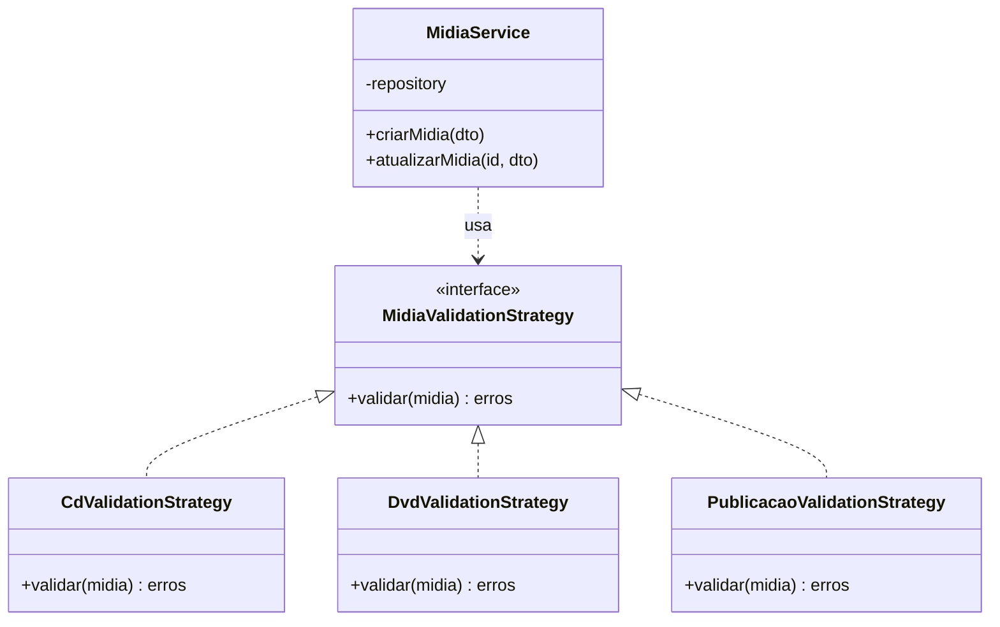
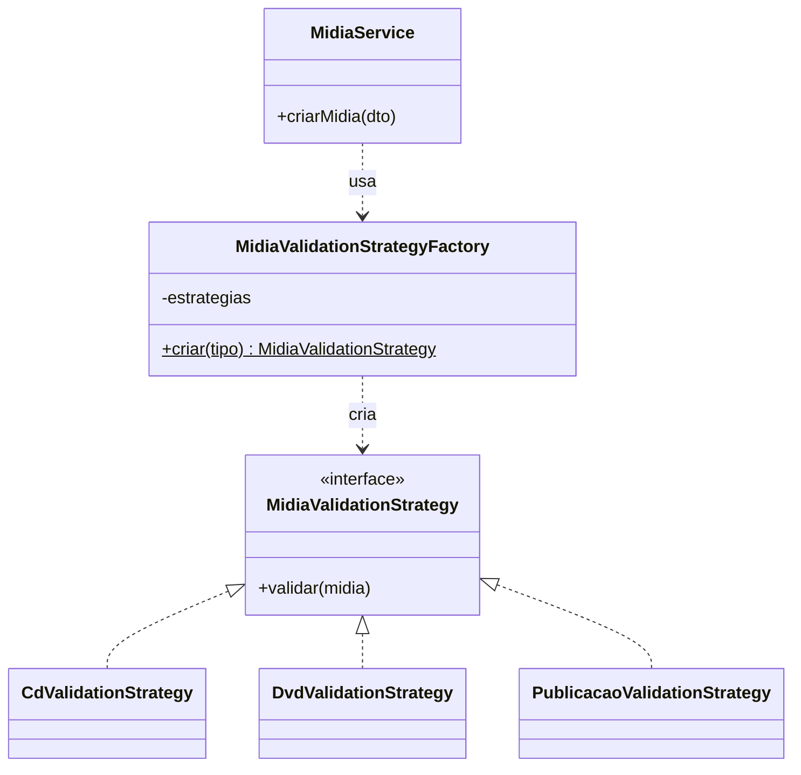
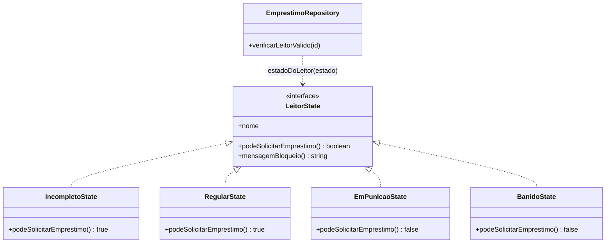
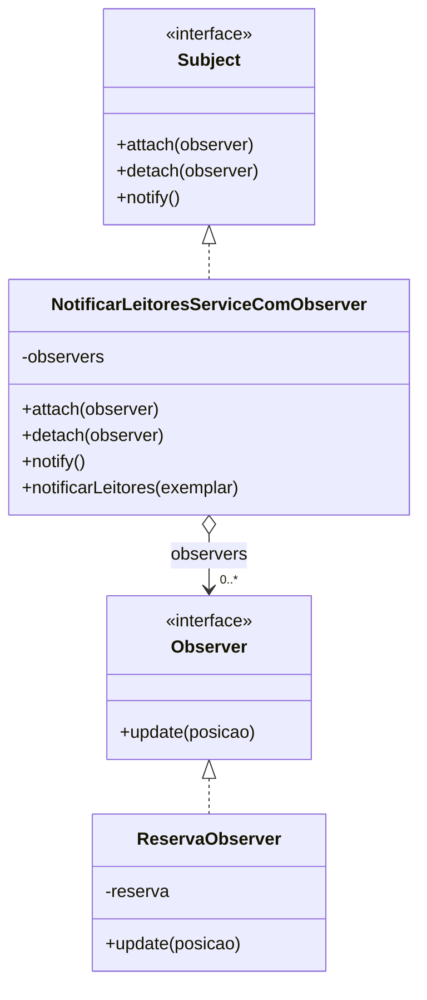
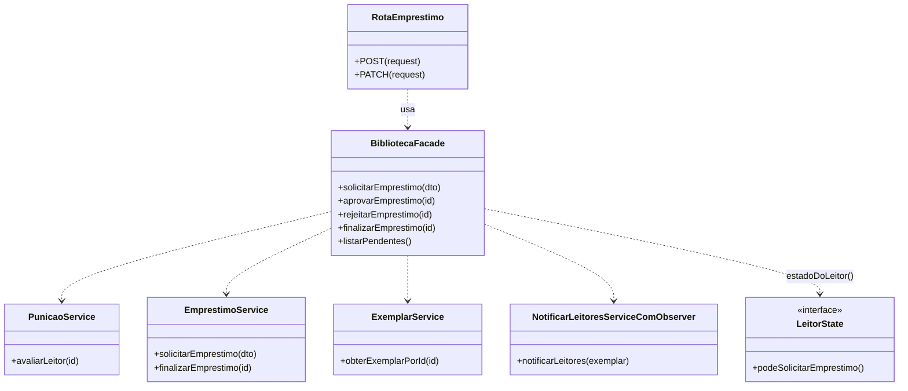

# Padrões de Projeto GoF — Noite Estrelada

Este documento descreve, em detalhe, os **cinco padrões de projeto GoF (Gang of Four)**
aplicados no sistema da biblioteca *Noite Estrelada*. Para cada padrão há: a
intenção do padrão, o problema concreto que ele resolveu neste projeto, os
participantes (papéis), o código **antes** e **depois**, e os benefícios obtidos.

| # | Padrão | Categoria GoF | Onde está |
|---|--------|---------------|-----------|
| 1 | [Strategy](#1-strategy-comportamental) | Comportamental | `src/domain/Midia/strategy/MidiaValidationStrategy.ts` |
| 2 | [Factory Method](#2-factory-method-criacional) | Criacional | `src/domain/Midia/strategy/MidiaValidationStrategyFactory.ts` |
| 3 | [State](#3-state-comportamental) | Comportamental | `src/domain/leitor/state/LeitorState.ts` |
| 4 | [Observer](#4-observer-comportamental) | Comportamental | `src/domain/Midia/observer/observerPattern.ts` |
| 5 | [Facade](#5-facade-estrutural) | Estrutural | `src/services/bibliotecaFacade.ts` |

> **Distribuição:** 1 criacional, 1 estrutural e 3 comportamentais.

---

## 1. Strategy (Comportamental)

### Intenção (GoF)
> Definir uma família de algoritmos, encapsular cada um deles e torná-los
> intercambiáveis. O Strategy permite que o algoritmo varie independentemente
> dos clientes que o utilizam.

### Problema no projeto
Cada tipo de mídia (CD, DVD, Publicação) tem **regras de validação diferentes**:
- **CD** — duração ≤ 80 min e a soma das faixas deve bater com a duração total.
- **DVD** — duração ≤ 120 min e código de região válido (`0`, `1`, `4`, `Todas`).
- **Publicação** — número de páginas entre 4 e 10000 e ISBN-10/ISBN-13 válido.

Sem o padrão, isso viraria um `switch (tipo)` gigante dentro do `MidiaService`,
misturando todas as regras num único método e dificultando a manutenção.

### Participantes
- **Strategy (interface):** `MidiaValidationStrategy` — declara `validar(midia)`.
- **Estratégias concretas:** `CdValidationStrategy`, `DvdValidationStrategy`,
  `PublicacaoValidationStrategy`.
- **Contexto (cliente):** `MidiaService`, que recebe uma estratégia e a executa
  sem conhecer os detalhes de cada validação.

### Diagrama UML



### Código

```ts
// src/domain/Midia/strategy/MidiaValidationStrategy.ts
export interface MidiaValidationStrategy {
    validar(midia: IMidiaDTO): { erros: Record<string, string> };
}

export class CdValidationStrategy implements MidiaValidationStrategy {
    validar(midia: IMidiaDTO) {
        const erros: Record<string, string> = {};
        const cd = midia.dados as ICdDTO;
        if (cd.duracao > 80) erros.duracao = "Duração do CD deve ser menor ou igual a 80 minutos";
        // ...soma das faixas, etc.
        return { erros };
    }
}
```

O `MidiaService` apenas pede a estratégia certa e a usa de forma uniforme:

```ts
const strategy = MidiaValidationStrategyFactory.criar(dto.tipo as TipoDeMidia);
const { erros } = strategy.validar(dto);
```

### Benefícios
- Cada regra de validação fica **isolada** em sua própria classe.
- Adicionar um novo tipo de mídia **não altera** o `MidiaService`.
- Facilita testes: cada estratégia pode ser testada isoladamente.

---

## 2. Factory Method (Criacional)

### Intenção (GoF)
> Definir uma interface para criar um objeto, mas deixar as subclasses (ou um
> ponto central de criação) decidirem qual classe instanciar.

> *Observação:* a implementação aqui é a variação conhecida como **Simple
> Factory / Factory Method estático** — um único ponto de criação que devolve a
> instância concreta adequada.

### Problema no projeto
**Antes**, o `MidiaService` importava as três classes concretas de Strategy e as
instanciava num mapa interno. Ou seja, o serviço **conhecia os detalhes de
criação** de cada estratégia — uma responsabilidade que não é dele.

```ts
// ANTES — dentro do MidiaService
import { CdValidationStrategy, DvdValidationStrategy, PublicacaoValidationStrategy } from "...";

private detectarStrategy = {
    [TipoDeMidia.CD]: new CdValidationStrategy(),
    [TipoDeMidia.DVD]: new DvdValidationStrategy(),
    [TipoDeMidia.PUBLICACAO]: new PublicacaoValidationStrategy(),
} as const;

const strategy = this.detectarStrategy[dto.tipo as TipoDeMidia];
```

### Participantes
- **Creator (fábrica):** `MidiaValidationStrategyFactory`.
- **Produto:** `MidiaValidationStrategy` (a interface comum).
- **Produtos concretos:** as três estratégias de validação.

### Diagrama UML



### Código

```ts
// src/domain/Midia/strategy/MidiaValidationStrategyFactory.ts
export class MidiaValidationStrategyFactory {
    private static readonly estrategias: Record<TipoDeMidia, () => MidiaValidationStrategy> = {
        [TipoDeMidia.CD]: () => new CdValidationStrategy(),
        [TipoDeMidia.DVD]: () => new DvdValidationStrategy(),
        [TipoDeMidia.PUBLICACAO]: () => new PublicacaoValidationStrategy(),
    };

    static criar(tipo: TipoDeMidia): MidiaValidationStrategy {
        const fabricar = this.estrategias[tipo];
        if (!fabricar) throw new Error(`Tipo de mídia sem estratégia de validação: ${tipo}`);
        return fabricar();
    }
}
```

```ts
// DEPOIS — dentro do MidiaService
const strategy = MidiaValidationStrategyFactory.criar(dto.tipo as TipoDeMidia);
```

### Benefícios
- Centraliza a **criação** das estratégias num único lugar.
- O `MidiaService` deixa de depender das classes concretas (baixo acoplamento).
- Suporte ao **Open/Closed Principle**: novo tipo = nova linha na fábrica.

### Relação com Strategy
A Factory **cria** o objeto Strategy; o Strategy **executa** o algoritmo. São
padrões complementares — um resolve "como construir", o outro "como variar o
comportamento".

---

## 3. State (Comportamental)

### Intenção (GoF)
> Permitir que um objeto altere seu comportamento quando seu estado interno
> muda. O objeto parecerá ter mudado de classe.

### Problema no projeto
O leitor pode estar em quatro estados (`enum EstadoLeitor`):
`INCOMPLETO`, `REGULAR`, `EM_PUNICAO`, `BANIDO`.

A regra "este leitor **pode** solicitar empréstimo?" e a mensagem de bloqueio
correspondente estavam **espalhadas e duplicadas** como comparações de string em
camadas diferentes:

```ts
// ANTES — no repositório
return leitor.estado === "REGULAR" || leitor.estado === "INCOMPLETO";

// ANTES — na rota de solicitação
if (estado === "BANIDO" || estado === "EM_PUNICAO") {
    const mensagem = estado === "BANIDO"
        ? "Conta bloqueada por atraso na devolução..."
        : "Você está em punição por atraso...";
    // ...
}
```

Qualquer novo estado obrigaria a caçar todos esses `if`s pelo sistema.

### Participantes
- **State (interface):** `LeitorState` — declara `podeSolicitarEmprestimo()` e
  `mensagemBloqueio()`.
- **Estados concretos:** `IncompletoState`, `RegularState`, `EmPunicaoState`,
  `BanidoState` — cada um encapsula o comportamento daquele estado.
- **Contexto:** o repositório / a fachada, que delega a decisão ao objeto de estado.
- **Resolução:** a função `estadoDoLeitor(estado)` mapeia o valor persistido para
  o objeto de estado correspondente.

### Diagrama UML



### Código

```ts
// src/domain/leitor/state/LeitorState.ts
export interface LeitorState {
    readonly nome: EstadoLeitor;
    podeSolicitarEmprestimo(): boolean;
    mensagemBloqueio(): string | null;
}

class BanidoState implements LeitorState {
    readonly nome = "BANIDO" as const;
    podeSolicitarEmprestimo() { return false; }
    mensagemBloqueio() {
        return "Conta bloqueada por atraso na devolução. Não é possível solicitar empréstimos.";
    }
}

export function estadoDoLeitor(estado: EstadoLeitor): LeitorState {
    return ESTADOS[estado];
}
```

Uso (o comportamento "muda de classe" conforme o estado do leitor):

```ts
// DEPOIS — no repositório
return estadoDoLeitor(leitor.estado).podeSolicitarEmprestimo();

// DEPOIS — na fachada, a própria mensagem vem do estado
estadoDoLeitor(estado).mensagemBloqueio();
```

### Benefícios
- Cada estado **conhece suas próprias regras** — nada de `if/else` espalhado.
- Adicionar um estado novo é criar **uma classe** e registrá-la no mapa.
- Elimina a duplicação entre repositório e rota.

---

## 4. Observer (Comportamental)

### Intenção (GoF)
> Definir uma dependência um-para-muitos entre objetos, de modo que, quando um
> objeto muda de estado, todos os seus dependentes são notificados e atualizados
> automaticamente.

### Problema no projeto
Quando um exemplar é **devolvido** (fica disponível), os leitores que reservaram
aquela mídia formam uma **lista de espera**. A primeira reserva da fila deve ser
promovida (vira bloqueante / empréstimo) e os demais leitores devem ser
**notificados de sua posição** na fila.

**Antes**, o padrão estava apenas esboçado e **não funcionava**:
- a interface `Observer` tinha um `update()` sobrecarregado de forma inválida;
- o serviço com Observer tinha três repositórios **nunca inicializados** (lançaria
  erro em tempo de execução);
- o container apontava para uma versão **sem** o padrão — ou seja, era código órfão.

### Participantes
- **Subject (interface):** declara `attach`, `detach`, `notify`.
- **Subject concreto:** `NotificarLeitoresServiceComObserver` — mantém a lista de
  observers (reservas) e dispara as notificações.
- **Observer (interface):** declara `update(posicao)`.
- **Observer concreto:** `ReservaObserver` — representa uma reserva e sabe se
  notificar de sua posição.

### Diagrama UML



### Código

```ts
// src/domain/Midia/observer/observerPattern.ts
export interface Observer {
    update(posicao: number): void;
}

export interface Subject {
    attach(observer: Observer): void;
    detach(observer: Observer): void;
    notify(): Promise<void> | void;
}

export class ReservaObserver implements Observer {
    constructor(private reserva: Reserva) {}
    update(posicao: number): void {
        console.log(`O leitor ${this.reserva.idLeitor} está na posição ${posicao} da lista de espera...`);
    }
}
```

```ts
// src/services/notificarLeitoresServiceComObserver.ts
export class NotificarLeitoresServiceComObserver implements Subject {
    private observers: ReservaObserver[] = [];

    attach(observer: Observer) { this.observers.push(observer as ReservaObserver); }
    detach(observer: Observer) { /* remove da lista */ }

    async notify() {
        // 1ª reserva vira BLOQUEANTE; as demais são notificadas de sua posição
        this.observers.slice(1).forEach((reserva, index) => reserva.update(index + 1));
    }
}
```

A integração agora é real: ao finalizar (devolver) um empréstimo, a
[Facade](#5-facade-estrutural) busca o exemplar e aciona o Subject.

### Benefícios
- O Subject **não conhece** os leitores concretos — só a interface `Observer`.
- Novos tipos de "interessados" poderiam ser adicionados sem mudar o Subject.
- A lógica de notificação fica desacoplada do fluxo de devolução.

---

## 5. Facade (Estrutural)

### Intenção (GoF)
> Fornecer uma interface unificada para um conjunto de interfaces de um
> subsistema. A Facade define uma interface de nível mais alto que torna o
> subsistema mais fácil de usar.

### Problema no projeto
O fluxo de empréstimos envolve **vários subsistemas** que precisam ser
coordenados na ordem certa:
1. `PunicaoService` — reavalia atrasos e atualiza o estado do leitor;
2. `LeitorState` — decide se aquele estado permite emprestar (e a mensagem);
3. `EmprestimoService` — aplica as regras de negócio do empréstimo;
4. `ExemplarService` + `NotificarLeitoresServiceComObserver` — na devolução,
   notifica a lista de espera (Observer).

**Antes**, cada **rota** da API orquestrava esses passos manualmente —
instanciava serviços, montava mensagens de erro e encadeava chamadas:

```ts
// ANTES — na rota /api/emprestimos/solicitar
const estado = await new PunicaoService().avaliarLeitor(idLeitor);
if (estado === "BANIDO" || estado === "EM_PUNICAO") {
    // ~15 linhas montando a resposta de bloqueio
}
const service = new EmprestimoService();
await service.solicitarEmprestimo({ idLeitor, idExemplar, diasEmprestimo });
```

### Participantes
- **Facade:** `BibliotecaFacade` — expõe métodos simples (`solicitarEmprestimo`,
  `finalizarEmprestimo`, `aprovarEmprestimo`, etc.).
- **Subsistemas:** `PunicaoService`, `EmprestimoService`, `ExemplarService`,
  `NotificarLeitoresServiceComObserver` e o helper `estadoDoLeitor` (State).
- **Clientes:** as rotas da API, que passam a falar **apenas** com a fachada.

### Diagrama UML



### Código

```ts
// src/services/bibliotecaFacade.ts
export class BibliotecaFacade {
    async solicitarEmprestimo(dto: IRealizarEmprestimoDTO): Promise<IEmprestimoResponse> {
        const estado = await this.punicaoService.avaliarLeitor(dto.idLeitor);
        if (estado) {
            const leitorState = estadoDoLeitor(estado);            // padrão State
            if (!leitorState.podeSolicitarEmprestimo()) {
                throw this.criarErro(
                    estado === "BANIDO" ? "LEITOR_BANIDO" : "LEITOR_EM_PUNICAO",
                    leitorState.mensagemBloqueio() ?? "Empréstimo não permitido.",
                    403
                );
            }
        }
        return this.emprestimoService.solicitarEmprestimo(dto);
    }

    async finalizarEmprestimo(id: string): Promise<IEmprestimoResponse> {
        const resultado = await this.emprestimoService.finalizarEmprestimo(id);
        try {
            const exemplar = await this.exemplarService.obterExemplarPorId(resultado.idExemplar);
            await new NotificarLeitoresServiceComObserver().notificarLeitores(exemplar); // Observer
        } catch (erro) {
            console.error("Falha ao notificar leitores em espera:", erro);
        }
        return resultado;
    }
}
```

```ts
// DEPOIS — a rota só conversa com a fachada
const solicitacao = await bibliotecaFacade.solicitarEmprestimo({ idLeitor, idExemplar, diasEmprestimo });
```

### Benefícios
- As rotas ficam **finas**: validação de entrada + chamada única à fachada.
- A coordenação entre subsistemas fica num único lugar reutilizável.
- A Facade é o ponto onde **State** e **Observer** se conectam ao fluxo real.

---

## Como os padrões se relacionam

```
                       BibliotecaFacade (Facade)
                                │
        ┌───────────────┬───────┴────────┬─────────────────────┐
        ▼               ▼                ▼                      ▼
  PunicaoService   LeitorState     EmprestimoService   NotificarLeitores...
                    (State)                              (Observer)

  MidiaService ──▶ MidiaValidationStrategyFactory (Factory) ──▶ ...Strategy
```

- **Factory** cria as **Strategies** de validação de mídia.
- **State** e **Observer** são orquestrados pela **Facade** no fluxo de empréstimo.
- Cada padrão resolve uma preocupação distinta: criação (Factory), variação de
  algoritmo (Strategy), comportamento por estado (State), notificação
  um-para-muitos (Observer) e simplificação de subsistema (Facade).

---

## Verificação

- Suíte de testes: **91 testes passando** (`npm test`).
- As refatorações preservam o comportamento existente — os mocks dos repositórios
  nos testes continuam compatíveis.
